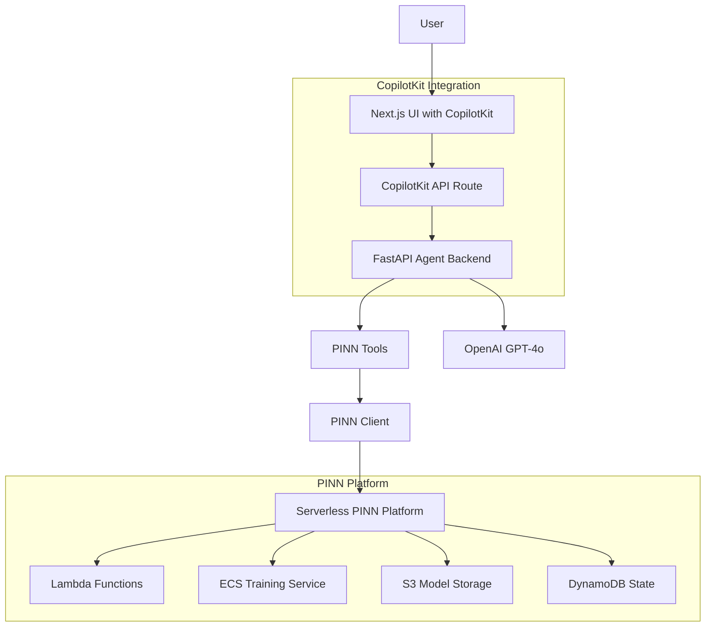

# PINN Solver Integration with CopilotKit

This guide explains how the Physics-Informed Neural Network (PINN) solver integrates with the CopilotKit framework, creating a complete serverless backend architecture for solving complex physics problems through conversational AI.

## Architecture Overview



## Integration Components

### 1. CopilotKit Frontend Integration

**File**: `coagents-pinn-solver/ui/app/page.tsx`

The UI integrates CopilotKit components:
- `CopilotKit` provider for agent communication
- `CopilotSidebar` for conversational interface
- Custom dashboard for workflow visualization

```typescript
<CopilotKit 
  runtimeUrl="/api/copilotkit"
  agent="pinn_solver_agent"
>
  <CopilotSidebar
    instructions="You are a PINN specialist..."
    labels={{
      title: "PINN Solver Assistant",
      initial: "Hi! I'm your PINN specialist..."
    }}
  />
</CopilotKit>
```

### 2. API Route Configuration

**File**: `coagents-pinn-solver/ui/app/api/copilotkit/route.ts`

Connects the UI to the agent backend:

```typescript
const runtime = new CopilotRuntime({
  remoteEndpoints: [
    {
      url: process.env.PINN_AGENT_URL || "http://localhost:8000/copilotkit",
    },
  ],
})
```

### 3. Agent Backend with FastAPI

**File**: `coagents-pinn-solver/agent/pinn_solver/demo.py`

FastAPI server that integrates with CopilotKit:

```python
from copilotkit.integrations.fastapi import add_fastapi_endpoint
from copilotkit import CopilotKitRemoteEndpoint, LangGraphAgent

sdk = CopilotKitRemoteEndpoint(
    agents=[
        LangGraphAgent(
            name="pinn_solver_agent",
            description="Physics-Informed Neural Network solver...",
            graph=graph,
        ),
    ],
)

add_fastapi_endpoint(app, sdk, "/copilotkit")
```

### 4. LangGraph Agent Implementation

**File**: `coagents-pinn-solver/agent/pinn_solver/langgraph/agent.py`

LangGraph workflow for PINN problem solving:

```python
workflow = StateGraph(PINNAgentState)
workflow.add_node("agent", call_model)
workflow.add_node("tools", tool_node)
workflow.add_conditional_edges("agent", should_continue)
```

### 5. PINN Tools Integration

**File**: `coagents-pinn-solver/agent/pinn_solver/tools/pinn_tools.py`

Tools that connect to the serverless PINN backend:

```python
class SolvePINNProblemTool(BaseTool):
    def _run(self, problem_description: str, domain_type: str):
        result = self.client.solve_physics_problem(...)
        return json.dumps(result)
```

### 6. Serverless Backend Client

**File**: `coagents-pinn-solver/agent/pinn_solver/core/pinn_client.py`

Client for interacting with the serverless PINN platform:

```python
class PINNClient:
    def solve_physics_problem(self, ...):
        response = self.session.post(
            f"{self.api_endpoint}/pinn/solve",
            json=request_data
        )
        return response.json()
```

## Data Flow

### 1. User Interaction Flow

1. **User Input**: User describes physics problem in natural language
2. **CopilotKit Processing**: UI sends message to CopilotKit API route
3. **Agent Routing**: API route forwards to FastAPI agent backend
4. **LLM Processing**: Agent uses GPT-4o to understand the problem
5. **Tool Selection**: Agent selects appropriate PINN tools
6. **Backend Communication**: Tools call serverless PINN platform
7. **Response Chain**: Results flow back through the same chain

### 2. PINN Workflow Execution

1. **Problem Analysis**: Agent analyzes physics problem description
2. **Configuration**: Determines optimal PINN architecture
3. **Submission**: Submits training job to serverless backend
4. **Monitoring**: Polls training status and provides updates
5. **Results**: Retrieves and visualizes completed results

## Environment Configuration

### Agent Backend (.env)

```bash
# OpenAI API Key
OPENAI_API_KEY=your_openai_api_key_here

# AWS Credentials for PINN Platform
AWS_ACCESS_KEY_ID=your_aws_access_key_id
AWS_SECRET_ACCESS_KEY=your_aws_secret_access_key
AWS_REGION=us-east-1

# PINN Platform API Endpoint
PINN_API_ENDPOINT=https://your-api-gateway-url.amazonaws.com/prod
```

### UI Frontend (.env.local)

```bash
# OpenAI API Key for CopilotKit
OPENAI_API_KEY=your_openai_api_key_here

# PINN Agent Backend URL
PINN_AGENT_URL=http://localhost:8000/copilotkit
```

## Deployment Strategies

### Development Environment

```bash
# Start the complete development environment
./deploy.sh dev
```

This starts:
- Agent backend on port 8000
- UI frontend on port 3000
- Automatic reload for both services

### Production Deployment

```bash
# Deploy serverless backend
./deploy.sh backend

# Deploy to production
./deploy.sh prod
```

Production deployment includes:
- Serverless PINN platform on AWS
- Containerized agent backend
- Static UI deployment

## Key Integration Benefits

### 1. Conversational Physics Solving

Users can describe complex physics problems in natural language:

```
"I need to solve a 2D heat conduction problem in a square domain. 
The left wall is at 100°C, right wall at 0°C, and top/bottom walls are insulated."
```

The agent automatically:
- Parses the problem description
- Sets up boundary conditions
- Configures PINN architecture
- Manages training process
- Provides results and visualizations

### 2. Seamless Scaling

The integration provides:
- **Frontend**: Responsive UI with real-time updates
- **Agent**: Stateful conversation management
- **Backend**: Serverless auto-scaling for compute-intensive training

### 3. Multi-Domain Support

Single interface for multiple physics domains:
- Heat Transfer
- Fluid Dynamics  
- Structural Mechanics
- Electromagnetics

### 4. Real-time Monitoring

Users get live updates on:
- Training progress
- Accuracy metrics
- Estimated completion time
- Error handling and recovery

## Advanced Features

### 1. Workflow Management

The integration tracks multiple concurrent PINN workflows:
- Status monitoring
- Progress visualization
- Result comparison
- Workflow history

### 2. Intelligent Problem Parsing

Natural language processing for:
- Boundary condition extraction
- Geometry definition
- Physics parameter identification
- Domain type classification

### 3. Adaptive Architecture Selection

Automatic PINN configuration based on:
- Problem complexity
- Accuracy requirements
- Available compute resources
- Training time constraints

### 4. Result Visualization

Integrated plotting and visualization:
- Contour plots
- 3D surface plots
- Vector field visualization
- Animation for transient problems

## Error Handling and Recovery

### 1. Graceful Degradation

- Backend unavailable: Show cached results
- Training failures: Suggest parameter adjustments
- Network issues: Queue requests for retry

### 2. User Feedback

- Clear error messages
- Suggested solutions
- Alternative approaches
- Help documentation links

## Performance Optimization

### 1. Caching Strategy

- Model caching for repeated inference
- Result caching for similar problems
- UI state persistence

### 2. Resource Management

- Intelligent GPU allocation
- Cost-aware scaling
- Training time optimization

## Security Considerations

### 1. API Security

- Authentication tokens
- Rate limiting
- Input validation
- Secure communication (HTTPS)

### 2. Data Protection

- Encrypted model storage
- Secure AWS credentials
- User data privacy
- Audit logging

## Monitoring and Observability

### 1. Application Metrics

- Response times
- Success rates
- Error frequencies
- User engagement

### 2. Infrastructure Metrics

- Lambda execution times
- ECS resource utilization
- S3 storage costs
- DynamoDB performance

## Future Enhancements

### 1. Advanced AI Features

- Multi-agent collaboration
- Automated mesh generation
- Uncertainty quantification
- Optimization integration

### 2. Platform Extensions

- Custom physics domains
- User-defined equations
- Collaborative workspaces
- Educational modules

This integration demonstrates how CopilotKit can be used to create sophisticated technical applications that combine conversational AI with complex computational backends, making advanced physics simulation accessible through natural language interaction.